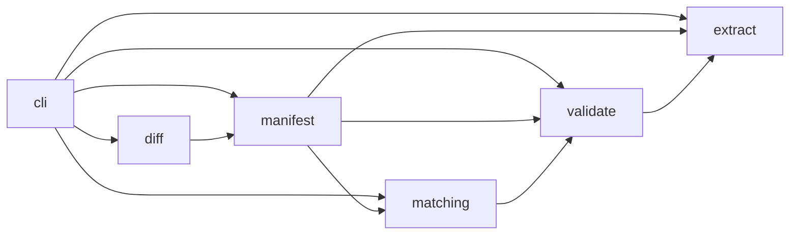
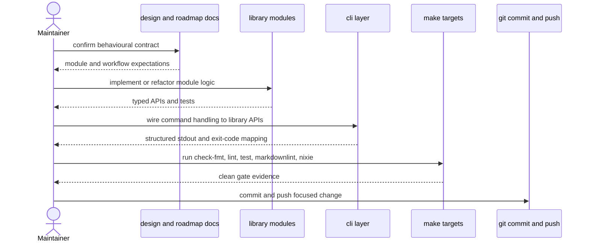

# Splitters developer's guide

This guide is for maintainers and contributors working on the Splitters
codebase. It documents the target module architecture, the current
implementation baseline, the expected integration boundaries, and the local
build, test, and release workflow for day-to-day development.

## 1. Normative references and current state

The primary source of truth for behaviour and architecture remains
[docs/splitters-design.md](docs/splitters-design.md). The implementation
sequence and expected delivery phases remain defined in
[docs/roadmap.md](docs/roadmap.md). This guide explains how contributors should
translate those documents into maintainable Rust modules and operational
workflows.

The current repository state is intentionally early:

- `src/main.rs` is a thin binary entry point.
- `src/lib.rs` currently exposes only a stub greeting used to keep the package
  compatible with the repository's lint and test gates.
- The architectural modules described below are target module boundaries that
  should be introduced incrementally as roadmap items land.

Contributors should therefore treat this guide as an implementation contract
for code that is about to be added, not as a claim that the full module graph
already exists in the current tree.

## 2. Architecture overview

Splitters should evolve into a library-first package with a thin command-line
interface (CLI) wrapper. The binary should remain responsible only for command
parsing, process exit behaviour, and human-facing terminal concerns. All
repository operations, manifest handling, fragment matching, and extraction
logic should live in library modules so they can be tested without spawning the
binary.

For screen readers: The following flowchart shows the intended high-level
module boundaries. The CLI enters through orchestrating library modules,
manifest data flows into matching and validation, diff generation feeds
manifest creation, and extraction depends on both validation and manifest state.

_Figure 1: Intended module dependency flow for the Splitters library and binary
entry point._

The dependency rule is strict:

- `cli` may depend on all command-serving modules, but those modules must not
  depend on `cli`.
- `extract` may depend on `validate`, `matching`, and `manifest`, because it
  reruns validation and persists manifest lifecycle updates.
- `validate` may depend on `matching` and `manifest`, because it consumes
  rematched fragments and proposal records.
- `matching` may depend on `manifest` types and `diff`-produced fragment
  representations, but it must not depend on `validate` or `extract`.
- `diff` and `manifest` should remain reusable foundations that do not depend
  on higher-level command orchestration modules.

## 3. Module responsibilities

Table 1: Target module responsibilities.

| Module     | Primary responsibility                                                                                           | Key inputs                                                         | Key outputs                                                                              |
| ---------- | ---------------------------------------------------------------------------------------------------------------- | ------------------------------------------------------------------ | ---------------------------------------------------------------------------------------- |
| `cli`      | Parse commands, map results to exit codes, route stdout and stderr                                               | Process arguments, environment, library result values              | Structured command reports, exit status                                                  |
| `manifest` | Load, validate, persist, and evolve manifest data                                                                | Manifest directory, serialized TOML and JSON, proposal identifiers | Typed manifest records, persistence side effects, schema diagnostics                     |
| `diff`     | Materialize the change universe and emit fragments                                                               | Git repository state, base ref, merge base                         | Fragment records, patch payloads, metadata mirrors                                       |
| `matching` | Rematch stored fragments against live repository state                                                           | Manifest fragment records, current diff state                      | Unique rematch results or stale and ambiguous-match errors                               |
| `validate` | Prove replayability and subtraction safety in isolated worktrees                                                 | Rematched fragments, proposal selection, optional check command    | Validation report, candidate and residual proof outcomes                                 |
| `extract`  | Create the extracted branch, subtract the validated patch set, update manifest lifecycle, and optionally publish | Validated proposal, target branch details, publish flag            | Extraction report, branch mutations, manifest updates, optional pull request side effect |

### 3.1. `cli`

`cli` should remain a translation layer. It should define the `clap` parser,
convert argument combinations into typed command requests, and map domain
results into the documented process exit codes.

Implementation guidance:

- Keep stdout machine-readable. Structured JSON reports belong on stdout, while
  progress and advisory text belong on stderr.
- Convert library errors into explicit exit code categories rather than
  printing raw debug output.
- Avoid placing repository logic, manifest parsing, or worktree mutation in the
  CLI layer.

### 3.2. `manifest`

`manifest` should own the public workflow contract on disk. It should define
schema types, version handling, proposal graph validation, and persistence
operations for `manifest.toml` plus fragment metadata mirrors.

Implementation guidance:

- Treat manifest `version` as a strict compatibility boundary.
- Keep serialization rules centralized so version upgrades do not leak across
  unrelated modules.
- Expose typed identifiers for fragments and proposals rather than passing raw
  strings throughout the codebase.

### 3.3. `diff`

`diff` should inspect the repository change universe defined by
`merge-base(base, HEAD)..HEAD` and convert it into stable fragment records plus
patch payloads.

Implementation guidance:

- Keep Git traversal and fragment construction deterministic.
- Separate textual hunks from file-level fragments such as pure renames,
  binary changes, and mode-only deltas.
- Prefer small helper functions for fragment classification rather than one
  monolithic diff walker.

### 3.4. `matching`

`matching` should resolve stored manifest fragments against the current
repository state. It is the layer that makes rebased or amended history either
recoverable or explicitly invalid.

Implementation guidance:

- Keep the rematch order stable: blob identifiers first, fingerprints second,
  path plus anchor context last.
- Reject ambiguous matches rather than guessing.
- Return diagnostics that let `validate` explain whether failure came from
  staleness, ambiguity, or repository-state drift.

### 3.5. `validate`

`validate` should be the safety barrier for all mutating commands. It should
create isolated candidate and residual worktrees, apply the selected fragments
forward and in reverse, and optionally run policy hooks through `--check`.

Implementation guidance:

- Keep worktree lifecycle management inside this module or in tightly scoped
  helper types that it owns.
- Treat `--check` failures as validation rejections and subprocess setup
  failures as operational errors.
- Preserve enough structured detail in the validation report for both human and
  agent callers to act on the result.

### 3.6. `extract`

`extract` should be the only module that mutates long-lived branch state. It
should rerun validation, materialize the candidate branch, subtract the exact
validated patch set from the current branch, update the manifest lifecycle, and
optionally publish through `gh`.

Implementation guidance:

- Reuse validated results rather than recomputing proposal contents from
  scratch during subtraction.
- Keep local repository mutation ordered and explicit so reflog-based recovery
  remains understandable.
- Treat remote publication as a post-extraction side effect rather than part of
  the local transaction boundary.

## 4. Integration points and hand-offs

The modules above are intentionally narrow, but their hand-offs must still be
clear and typed. The most important integration points are:

- `cli` to `manifest`: command entry loads manifest state and checks proposal
  identifiers before calling deeper logic.
- `diff` to `manifest`: `map` produces fragment and proposal-ready records that
  the manifest layer persists.
- `manifest` to `matching`: rematching consumes stored fragment records and
  current repository state.
- `matching` to `validate`: validation should operate on rematch results rather
  than raw manifest fragments so stale-state handling is centralized.
- `validate` to `extract`: extraction should consume the same proof inputs that
  passed validation, not reconstruct a different patch set later.

For screen readers: The following sequence diagram shows the preferred
maintainer workflow for implementing one command change. Work begins by
updating the normative design or roadmap if the contract changes, then code
lands in the library modules, the CLI adapts to the new types, and the
maintainer runs the repository gate stack before committing.

_Figure 2: Preferred contributor workflow from design confirmation through gate
verification and publication._

## 5. Implementation workflow

Contributors should introduce the planned modules incrementally rather than
landing a single large refactor. The practical order already exists in
`docs/roadmap.md` and should remain the default implementation path:

1. Establish the `cli` surface and exit-code mapping.
2. Introduce `manifest` schema types and proposal validation.
3. Add `diff` fragment construction and persistence.
4. Add `matching` rematch logic for stale-history handling.
5. Add `validate` worktree proof execution and `--check` policy hooks.
6. Add `extract` branch materialization, subtraction, and optional
   publication.

When a change alters the behavioural contract, the contributor should update
`docs/splitters-design.md` first or in the same patch set. When a change alters
delivery sequencing or validation scope, the contributor should update
`docs/roadmap.md` in the same patch set.

## 6. Build, test, and lint procedure

The repository uses `make` targets as the supported maintainer interface.
Contributors should prefer these targets over raw Cargo commands unless a
focused debugging session requires lower-level invocation.

Table 2: Maintainer command surface.

| Command             | Purpose                                                       |
| ------------------- | ------------------------------------------------------------- |
| `make check-fmt`    | Verify Rust formatting without modifying files                |
| `make lint`         | Run Rustdoc, Clippy, and Whitaker when available              |
| `make test`         | Run the configured test runner and documentation tests        |
| `make all`          | Replay the main Rust gate stack: format check, lint, and test |
| `make fmt`          | Apply Rust and Markdown formatting                            |
| `make markdownlint` | Lint Markdown files                                           |
| `make nixie`        | Validate Mermaid diagrams                                     |
| `make build`        | Build the debug binary                                        |
| `make release`      | Build the release binary                                      |

The expected maintainer gate order for documentation and code changes in this
repository is:

1. `make fmt` when formatting fixes are needed.
2. `make markdownlint` for documentation changes.
3. `make nixie` when Mermaid diagrams are added or changed.
4. `make check-fmt`
5. `make lint`
6. `make test`

Contributors should tee command output to `/tmp` logs during substantial work
so gate evidence survives long output truncation. The repository has repeatedly
required this pattern during review follow-ups and release-style passes.

## 7. Release and publication procedure

The current release process is intentionally lightweight because Splitters is
still at the stub and design-validation stage.

The expected local release workflow is:

1. Ensure the relevant design, roadmap, and guide documents match the current
   implementation contract.
2. Run the full local gate stack described above.
3. Build the release binary with `make release`.
4. Verify the binary name and target path match the intended package surface.
5. Commit the change with a file-based commit message.
6. Push the branch and capture the exact remote response.

The roadmap already reserves later work for GitHub Actions, packaged release
artefacts, and wider platform coverage. Until that lands, maintainers should
not claim automated release guarantees that the repository does not yet provide.

## 8. Contributor guardrails

Contributors should preserve the following engineering rules while the module
graph fills in:

- Keep the binary thin and place reusable logic in library modules.
- Prefer explicit domain types over passing raw strings and paths between
  modules.
- Keep filesystem and Git side effects behind narrow, testable boundaries.
- Add or update tests whenever behaviour changes, especially around manifest
  compatibility, fragment identity, replay safety, and subtraction safety.
- Keep the design document, roadmap, and developer's guide synchronized when
  architectural boundaries or responsibilities change.
