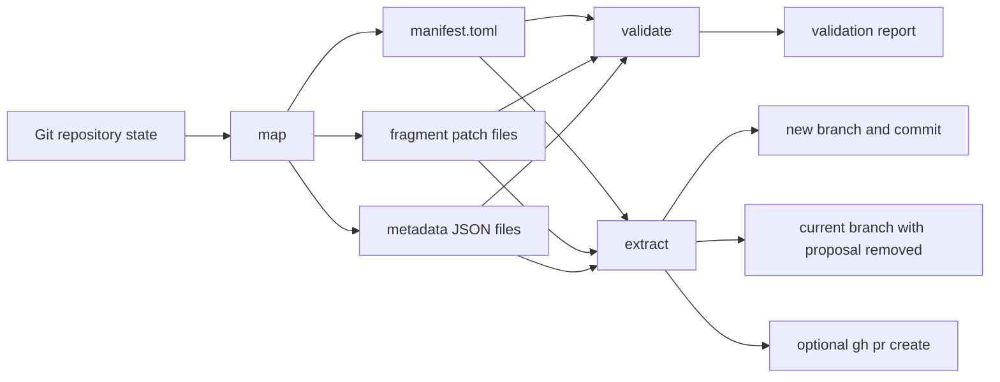

# Splitters design

- Status: Draft
- Audience: Maintainers and reviewers evaluating the architecture and the
  command contracts
- Scope: A deterministic command-line interface (CLI) for decomposing one Git
  branch diff into smaller proposals and extracted branches
- Companion documents: `docs/documentation-style-guide.md`
- Last updated: 2026-04-15

## 1. Summary

Splitters is a Rust CLI for decomposing a mixed feature branch into smaller,
reviewable pull requests without relying on an interactive terminal. Existing
stacked-branch tools already support branch splitting, but their split flows
remain centred on interactive hunk selection or terminal user interfaces rather
than on a manifest that an agent or script can edit deterministically.[^1][^2]
Splitters therefore treats the diff between `merge-base(base, HEAD)` and `HEAD`
as structured data, emits addressable fragments, and executes only the
proposals declared in that manifest.

The design prioritizes determinism, recoverability, and machine-readable
contracts over convenience features. Splitters stores no state in a daemon,
database, or hidden metadata directory. Repository state plus files under the
chosen output directory fully describe the workflow.

## 2. Goals and non-goals

Splitters has five primary goals:

- Materialize the change universe from `merge-base(base, HEAD)..HEAD` into
  stable, addressable fragments.
- Allow a human or an agent to group fragments into named proposals by editing
  a TOML manifest.
- Validate both the candidate branch and the residual branch before any
  mutation of the current branch.
- Extract one validated proposal into a new branch and subtract that exact
  change set from the current branch.
- Keep every command scriptable through structured stdout and stable exit
  codes.

Splitters explicitly does not attempt to provide the following in version 1 of
the design:

- An interactive hunk picker, terminal user interface, or web interface.
- Semantic code analysis, abstract syntax tree based grouping, or automatic
  proposal generation.
- Automatic conflict resolution when a fragment no longer applies.
- Forge support beyond optional GitHub publication through `gh pr create`.[^5]
- Multi-repository orchestration or submodule-aware extraction.

## 3. Terminology

Table 1: Core terms used throughout the design.

| Term             | Meaning                                                                                                                                             |
| ---------------- | --------------------------------------------------------------------------------------------------------------------------------------------------- |
| Base ref         | The Git reference against which Splitters computes `merge-base(base, HEAD)` and onto which an extracted proposal is replayed.                       |
| Change universe  | The complete diff between the merge base and `HEAD`.                                                                                                |
| Fragment         | The smallest selectable unit emitted by `map`. A fragment may represent a textual hunk, a binary file change, a pure rename, or a file mode change. |
| Fingerprint      | The authoritative, content-derived identity for a fragment. It is stable across remaps when the changed content and anchors still match.            |
| Proposal         | A named set of fragments that Splitters validates and may later extract as one branch.                                                              |
| Candidate branch | The synthetic branch created by applying one proposal onto the selected base ref.                                                                   |
| Residual branch  | The current branch after subtracting the proposal that was extracted elsewhere.                                                                     |
| Shared context   | Byte-identical unchanged lines used to anchor a fragment. Shared context is not a selectable fragment.                                              |

## 4. Users and actors

Table 2: Expected users and system actors.

| Actor                      | Goal                                                                     | Constraints                                                          |
| -------------------------- | ------------------------------------------------------------------------ | -------------------------------------------------------------------- |
| Coding agent               | Split a large branch into reviewable proposals without a pseudo-terminal | Needs deterministic files, stable identifiers, and structured output |
| Human developer            | Carve a refactor or fix out of a mixed branch                            | Needs readable manifests and reliable rollback                       |
| Continuous integration job | Detect over-large pull requests and run non-destructive validation       | Must avoid hidden state and must not require manual input            |
| Git repository             | Source of truth for commits, blobs, refs, and worktrees                  | May be large, rebased, or partially rewritten between runs           |
| GitHub CLI                 | Optional publication path for a validated extraction                     | May be unavailable, unauthenticated, or partially configured         |

## 5. Design constraints

The design assumes the following constraints are non-negotiable:

- Splitters operates on committed history only. `map`, `validate`, and
  `extract` reject staged or unstaged changes in the working tree. This keeps
  the change universe deterministic and makes every fragment reproducible.
- The fragment is the atomic extraction unit. A selectable line may belong to
  one proposal only.
- `extract` reruns validation immediately before mutation. A stale validation
  report is advisory only.
- Repository safety has precedence over convenience. If Splitters cannot prove
  that candidate creation and residual subtraction are both clean, it stops.
- Publishing is optional and outside the core transaction boundary. The local
  extraction succeeds or fails independently of remote pull request
  creation.[^5]

## 6. Architecture overview

Splitters follows a manifest-driven pipeline with three commands: `map`,
`validate`, and `extract`. The manifest is the only persisted workflow state.
`map` materializes fragments. `validate` proves that one proposal can be
replayed onto the base and removed from the current branch. `extract` reruns
that proof, creates the new branch, and then subtracts the exact fragment set
from the current branch.

Figure 1: Splitters command flow and artefact boundaries.



Figure 1 shows the central design choice: Splitters does not keep long-lived
runtime state. Each command reconstructs its decisions from repository state
and the persisted manifest artefacts.

Three execution boundaries matter:

- The Rust core owns repository discovery, diff inspection, manifest I/O,
  fragment matching, and commit orchestration.
- Git patch and worktree primitives provide the applicability and isolation
  guarantees that Splitters needs for safe dry runs and subtraction.[^3][^4]
- GitHub publication is a thin optional wrapper around `gh pr create`, with
  `--base` and `--head` supplied explicitly to avoid ambiguous defaults.[^5]

## 7. Command contracts

### 7.1 `map`

`map` computes the change universe defined by `merge-base(base, HEAD)..HEAD`,
decomposes it into fragments, and writes a manifest directory.

Table 3: `map` contract.

| Item            | Contract                                                                                          |
| --------------- | ------------------------------------------------------------------------------------------------- |
| Inputs          | Base ref, output directory                                                                        |
| Preconditions   | Repository exists, `HEAD` resolves, working tree and index are clean                              |
| Outputs on disk | `manifest.toml`, `fragments/*.patch`, `metadata/*.json`                                           |
| Stdout          | One JSON summary object                                                                           |
| Exit code       | `0` on success, `1` on rejected repository state or invalid arguments, `2` on operational failure |

`map` emits fragments for the following change kinds:

- Textual hunks for modified files.
- Synthetic file-level fragments for new empty files and deleted empty files.
- Atomic file-level fragments for binary additions, deletions, and
  modifications.
- Atomic metadata fragments for pure renames and pure mode changes.

Rename-plus-edit changes are split into one rename fragment and one or more
content fragments that depend on the rename being applied first. This avoids
overloading one fragment with two unrelated failure modes.

### 7.2 `validate`

`validate` accepts a manifest directory and one proposal identifier. It answers
three questions:

1. Can Splitters still locate each fragment in the current change universe?
2. Can the selected fragment set be replayed cleanly onto the base ref?
3. Can the same fragment set be removed cleanly from the current branch?

Table 4: `validate` contract.

| Item          | Contract                                                                                |
| ------------- | --------------------------------------------------------------------------------------- |
| Inputs        | Manifest directory, proposal identifier, optional base override, optional check command |
| Preconditions | Repository exists, working tree and index are clean, manifest schema is valid           |
| Side effects  | None in the main worktree                                                               |
| Stdout        | One JSON validation report                                                              |
| Exit code     | `0` when the proposal is valid, `1` when validation fails, `2` on operational failure   |

If `--check <cmd>` is supplied, Splitters runs that command once in the
candidate worktree and once in the residual worktree. A non-zero exit status
from the check command makes validation fail with exit code `1`. Failure to
spawn the check command, or failure to create a worktree in which it could run,
is an operational error with exit code `2`.

### 7.3 `extract`

`extract` consumes one proposal, reruns validation, creates a new branch from
the chosen base, commits the proposal there, and subtracts the exact same
change set from the current branch.

Table 5: `extract` contract.

| Item                        | Contract                                                                                                    |
| --------------------------- | ----------------------------------------------------------------------------------------------------------- |
| Inputs                      | Manifest directory, proposal identifier, optional base override, optional branch name, optional `--publish` |
| Preconditions               | Repository exists, working tree and index are clean, proposal revalidates immediately before mutation       |
| Local side effects          | New branch and commit, current branch rewritten by subtraction                                              |
| Optional remote side effect | `gh pr create` for the extracted branch                                                                     |
| Stdout                      | One JSON extraction report                                                                                  |
| Exit code                   | `0` on success, `1` on rejected validation, `2` on operational failure                                      |

`extract` is locally atomic at the repository-state level:

- If candidate branch creation fails, the current branch remains unchanged.
- If subtraction fails after candidate creation, Splitters aborts and leaves the
  candidate branch intact for manual recovery.
- Splitters never performs remote publication before the local extraction has
  succeeded.

Remote publication is intentionally non-atomic. If `gh pr create` fails after
local extraction, Splitters reports the failure and leaves local Git state
unchanged from the successful extraction.[^5]

## 8. On-disk contract

The manifest directory is the public workflow contract between Splitters and
the caller.

```plaintext
splitters/
  manifest.toml
  fragments/
    frag-0001.patch
    frag-0002.patch
  metadata/
    frag-0001.json
    frag-0002.json
```

`manifest.toml` is the normative source of truth. The patch files contain the
exact unified diff payload used for replay and subtraction. The metadata JSON
files duplicate the fragment record in a format that agents can consume without
parsing TOML.

Table 6: Top-level manifest fields.

| Field               | Meaning                                                         |
| ------------------- | --------------------------------------------------------------- |
| `version`           | Manifest schema version. Version `1` is defined by this design. |
| `base_ref`          | Base ref used when the manifest was produced                    |
| `head_oid`          | Exact `HEAD` commit used during `map`                           |
| `merge_base_oid`    | Merge base between `base_ref` and `HEAD` at map time            |
| `change_range`      | Human-readable form of the mapped range                         |
| `generated_at_unix` | Generation timestamp for diagnostics only; not used in matching |

Table 7: Fragment fields.

| Field                              | Meaning                                                         |
| ---------------------------------- | --------------------------------------------------------------- |
| `id`                               | Human-readable identifier, stable within one manifest directory |
| `fingerprint`                      | Content-derived identity used for rematching                    |
| `change_kind`                      | `modify`, `add`, `delete`, `rename`, `mode`, or `binary`        |
| `path_before`                      | Path at the base side of the diff, if any                       |
| `path_after`                       | Path at the head side of the diff, if any                       |
| `old_blob` / `new_blob`            | Blob object identifiers when Git provides them                  |
| `old_span` / `new_span`            | Original hunk ranges for textual fragments                      |
| `context_before` / `context_after` | Unchanged anchor lines used to relocate textual fragments       |
| `patch_file`                       | Relative path to the patch payload                              |
| `metadata_file`                    | Relative path to the JSON mirror                                |

Table 8: Proposal fields.

| Field        | Meaning                                                   |
| ------------ | --------------------------------------------------------- |
| `id`         | Stable proposal identifier                                |
| `title`      | Pull request or commit title                              |
| `body`       | Optional pull request body                                |
| `fragments`  | Ordered fragment identifiers                              |
| `depends_on` | Ordered proposal identifiers that must be extracted first |
| `branch`     | Optional explicit branch name override                    |

The following example shows the intended shape without fixing the tool to one
exact serialisation layout beyond the required fields.

```toml
version = 1
base_ref = "origin/main"
head_oid = "6a7b0a9d8d0d6a..."
merge_base_oid = "a1b2c3d4e5f6..."
change_range = "a1b2c3d4e5f6..HEAD"
generated_at_unix = 1776211200

[[fragment]]
id = "frag-0001"
fingerprint = "sha256:2e52b7856c92..."
change_kind = "modify"
path_before = "src/lib.rs"
path_after = "src/lib.rs"
old_blob = "91f7..."
new_blob = "ab12..."
old_span = { start = 120, count = 8 }
new_span = { start = 120, count = 12 }
context_before = ["fn parse(...)", "match state {"]
context_after = ["}", ""]
patch_file = "fragments/frag-0001.patch"
metadata_file = "metadata/frag-0001.json"

[[proposal]]
id = "parser-refactor"
title = "Refactor parser state transitions"
fragments = ["frag-0001", "frag-0007", "frag-0012"]
depends_on = []
```

## 9. Fragment identity and proposal rules

The draft design left fragment identity underspecified. Sequential identifiers
such as `0001` are readable, but they are not sufficient for relocating a
fragment after a rebase. Splitters therefore distinguishes between a readable
`id` and an authoritative `fingerprint`.

The fingerprint is derived from the following normalized fields:

- Change kind.
- Path before and path after.
- Added and removed lines for textual hunks.
- File metadata delta for mode-only changes.
- Binary patch hash for binary fragments.
- Adjacent unchanged context, when available.

During `validate`, Splitters resolves each fragment in this order:

1. Direct match on stored blob identifiers when the original blobs still exist.
2. Fingerprint match against the current change universe.
3. Anchor match using path plus surrounding context.

If more than one candidate matches, validation fails rather than guessing. If
no candidate matches, validation fails and reports the fragment as stale.

Proposal rules are equally strict:

- A proposal must list each fragment at most once.
- Two proposals may not claim the same fragment.
- Two different fragments may not claim overlapping changed lines in the same
  current diff.
- `depends_on` must form a directed acyclic graph.
- Extraction order follows the proposal graph, but `extract` still operates on
  one proposal at a time.

## 10. Validation model

Validation is the core safety barrier. Splitters creates two throwaway linked
worktrees so that the proof runs against isolated indexes and working trees
rather than against the caller’s checkout.[^4]

Table 9: Validation stages.

| Stage            | Purpose                                              | Failure result                              |
| ---------------- | ---------------------------------------------------- | ------------------------------------------- |
| Rematch          | Confirm each fragment can still be located           | Proposal is stale                           |
| Candidate replay | Apply the selected fragments onto the base ref       | Proposal cannot be extracted cleanly        |
| Residual replay  | Reverse the same fragments from `HEAD`               | Current branch cannot be reduced cleanly    |
| Optional checks  | Run caller-supplied command in both synthetic states | Proposal is invalid for the supplied policy |

The candidate worktree starts from the chosen base ref. Splitters applies the
selected fragment patches there and checks that the result is clean. Git’s own
patch machinery already supports dry-run applicability checks and reverse patch
application, so Splitters uses that semantics rather than inventing one.[^3]

The residual worktree starts from `HEAD`. Splitters applies the selected patch
set in reverse there. This is the crucial design choice that prevents drift:
Splitters does not recompute a residual diff from scratch. It subtracts the
validated patch set that it intends to extract.

## 11. Extraction and rollback model

`extract` performs the following ordered steps:

1. Load the manifest and proposal.
2. Rerun the full validation sequence.
3. Create or reset the target branch from the chosen base ref.
4. Materialize the candidate commit in an isolated worktree.
5. Move that commit onto the target branch.
6. Apply the validated reverse patch to the current branch.
7. Update the manifest to mark the proposal as extracted.
8. Optionally publish through `gh pr create`.

The subtraction step uses the exact patch set that passed validation, applied
in reverse. Git already defines reverse patch application through
`git apply --reverse`, which is the behaviour this design relies upon.[^3]

Recovery guarantees are intentionally modest and explicit:

- The new branch commit is recoverable through normal Git references and
  reflog.
- The pre-subtraction state of the current branch is recoverable through reflog.
- Splitters does not promise an all-or-nothing transaction across both local
  Git mutation and remote publication.

## 12. Implementation approach

Rust is an appropriate implementation language because Splitters needs a single
portable binary, low-level Git manipulation, and strict control over error
handling. `clap` derive macros provide a concise way to express the command and
flag surface while still generating strong help output and typed parsing.[^7]

The design uses a hybrid Git integration strategy:

- `git2` handles repository discovery, merge-base calculation, diff traversal,
  worktree enumeration, and commit-oriented repository operations.[^6]
- `git apply` handles applicability checks and exact reverse subtraction because
  its behaviour is defined directly on unified diff payloads and aligns with
  the emitted patch files.[^3]
- `git worktree` provides isolated dry-run checkouts with per-worktree `HEAD`
  and index state, which makes candidate and residual testing safe.[^4]
- `gh pr create` remains an optional subprocess that receives explicit
  `--base`, `--head`, `--title`, and `--body` arguments.[^5]

The internal module split should follow the public responsibilities rather than
the transport layer:

- `cli` for argument parsing and exit-code mapping.
- `manifest` for schema and proposal validation.
- `diff` for fragment construction and fingerprinting.
- `matching` for rematching stale manifests against the current change universe.
- `validate` for candidate and residual proof execution.
- `extract` for branch creation, subtraction, and optional publication.

## 13. Testing and verification

Splitters needs three layers of verification.

Table 10: Verification layers.

| Layer               | Purpose                                                                                                     |
| ------------------- | ----------------------------------------------------------------------------------------------------------- |
| Unit tests          | Fingerprint generation, proposal graph validation, overlap detection, manifest round-trips                  |
| Integration tests   | End-to-end `map`, `validate`, and `extract` flows in temporary repositories                                 |
| Regression fixtures | Edge cases such as pure renames, binary files, mode-only changes, empty-file changes, and rebased manifests |

The highest-risk properties are behavioural rather than algorithmic:

- `validate` must reject ambiguous fragment matches.
- `extract` must not mutate the current branch if candidate creation fails.
- Reverse subtraction must remove only the selected proposal.
- The same proposal must produce identical patch payloads when repository state
  is unchanged.

Property-style tests are appropriate for overlap and subtraction invariants.
For example, the union of the extracted proposal and the residual patch should
reconstruct the original change universe exactly when both sides validate.

## 14. Alternatives considered

Splitters exists because adjacent tools solve a different problem.

Graphite already supports `gt split`, including `--by-hunk`, but its hunk mode
is an iterative wrapper around `git add --patch`. That is effective for a human
operator, but it is not a deterministic file contract for an agent.[^1]

stax is closer in implementation language and audience, and it now supports
`st split --hunk`, but it remains a broader stacked-branch workflow with an
interactive terminal user interface, smart pull request features, and other
stateful branch-management concerns that Splitters deliberately excludes.[^2]

Raw Git plumbing is also insufficient on its own. `git apply`, `git worktree`,
and related commands provide the safety-critical primitives Splitters needs,
but they do not provide stable fragment identity, proposal validation, or a
manifest that survives across iterations.[^3][^4]

## 15. Risks and deferred decisions

Several risks remain after the gaps above are filled.

Table 11: Material risks and deferred decisions.

| Topic                               | Current decision                                       | Remaining risk                                                      |
| ----------------------------------- | ------------------------------------------------------ | ------------------------------------------------------------------- |
| Stale manifests after large rebases | Use content-derived fingerprints plus context anchors  | Large-scale file movement may still require regeneration            |
| Binary and metadata-only changes    | Treat them as atomic file-level fragments              | Coarse granularity may force larger proposals                       |
| Publication after extraction        | Keep publishing outside the local transaction boundary | Users may need manual cleanup after remote failures                 |
| Forge support                       | Restrict v1 to `gh`                                    | Other forges require a separate publishing abstraction              |
| Working-tree scope                  | Reject uncommitted changes                             | Some users may want mixed committed and uncommitted splitting later |

Two deferred decisions are worth preserving explicitly:

- Whether a future manifest version should record an extracted proposal’s
  resulting commit object identifier and pull request URL.
- Whether Splitters should eventually add a `remap` command that rewrites an
  existing manifest after a rebase rather than requiring `validate` to perform
  rematching on demand.

## 16. References

The numbered footnotes below are the authoritative external references used to
justify the design constraints and implementation choices in this document.

[^1]: Graphite, “Squash, fold, and split changes”, documents `gt split` and
  describes `--by-hunk` as iterative calls to `git add --patch`. Accessed
  2026-04-15. <https://graphite.com/docs/squash-fold-split>
[^2]: `cesarferreira/stax` README, which describes stax as a modern stacked
  branch CLI with an interactive terminal user interface and `st split`
  support. Accessed 2026-04-15. <https://github.com/cesarferreira/stax>
[^3]: Git documentation for `git-apply`, including `--check`, `--index`, and
  `--reverse`. Accessed 2026-04-15. <https://git-scm.com/docs/git-apply>
[^4]: Git documentation for `git-worktree`, which describes linked worktrees,
  per-worktree `HEAD` and index state, and add/remove lifecycle behaviour.
  Accessed 2026-04-15. <https://git-scm.com/docs/git-worktree>
[^5]: GitHub CLI manual for `gh pr create`, including explicit `--base` and
  `--head` behaviour and the optional nature of prompting and push handling.
  Accessed 2026-04-15. <https://cli.github.com/manual/gh_pr_create>
[^6]: `git2::Repository` documentation, which exposes repository apply,
  apply-to-tree, and worktree operations used by the Rust core. Accessed
  2026-04-15. <https://docs.rs/git2/latest/git2/struct.Repository.html>
[^7]: `clap` derive reference, which documents `Parser`, `Subcommand`, and
  doc-comment-driven help generation for typed CLI surfaces. Accessed
  2026-04-15. <https://docs.rs/clap/latest/clap/_derive/index.html>
